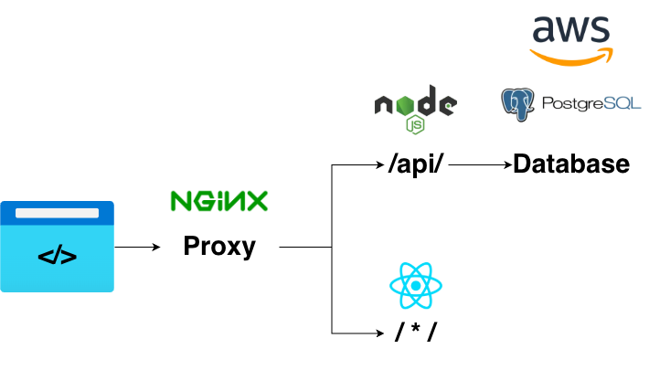

# E-commerce Fullstack

Access the project here: [Ecommerce Website](https://ecommerce-nodejs-75ce.onrender.com/products)\
Obs: it's hosted on free-tier Render so it might be "sleeping" when accessed. Please refresh the page after loading.

## Architecture



## API Endpoints

| Method | Route | Auth | Permission | Description |
|---|---|---|---|---|
| POST | `/api/v1/users/register` | No | — | Create account |
| POST | `/api/v1/users/login` | No | — | Authenticate, returns JWT |
| GET | `/api/v1/users/allusers` | Yes | `read_user` | List all users (admin) |
| GET | `/api/v1/users/:id` | Yes | `read_user` | Get user by ID (admin) |
| GET | `/api/v1/products` | No | — | List products (paginated) |
| GET | `/api/v1/products/:id` | No | — | Get product details |
| POST | `/api/v1/products` | Yes | `create_product` | Create product (admin) |
| PUT | `/api/v1/products/:id` | Yes | `update_product` | Update product (admin) |
| DELETE | `/api/v1/products/:id` | Yes | `delete_product` | Delete product (admin) |
| POST | `/api/v1/cart/addItem` | Yes | `create_cart` | Add item to cart |
| GET | `/api/v1/cart/getItems` | Yes | `read_cart` | Get cart items |
| DELETE | `/api/v1/cart/remove/:productId` | Yes | `delete_cart` | Remove item from cart |
| POST | `/api/v1/payment/pix` | Yes | — | Process PIX payment |
| POST | `/api/v1/payment/credit-card` | Yes | — | Process credit card payment |
| GET | `/api/v1/payment/transactions` | Yes | `read_user` | List all transactions (admin) |
| GET | `/api/v1/admin/stats` | Yes | `read_user` | Dashboard metrics (admin) |
| GET | `/api/v1/health` | No | — | Health check + DB status |


## Tech Stack

| Layer | Technology |
|---|---|
| Frontend | React 19 · TypeScript · Vite |
| Styling | Tailwind CSS v4 |
| State | Context API + Hooks |
| HTTP | Axios (interceptors for JWT + 401 redirect) |
| Routing | React Router v7 |
| Backend | Node.js · Express (JavaScript) | 
| ORM | Sequelize |
| Database | PostgreSQL (AWS Aurora) |
| Storage | AWS S3 (product images) |
| Auth | JWT + bcryptjs + RBAC |
| Security | Helmet · CORS · Rate Limiting · Input Validation |
| Tests (Backend) | Jest + supertest (22 tests · 67% coverage) |
| Tests (Frontend) | Vitest + React Testing Library (21 tests) |
| Tests (E2E) | Cypress |
| Infra | Docker + docker-compose |
| Deploy | Render (backend + frontend) · AWS Aurora (database) · AWS S3 (images) |


## Getting Started

### Prerequisites

- Node.js 20+
- PostgreSQL (or Docker)
- npm

### Run locally

```bash
# Backend
cd Backend
cp .env.example .env   # configure DB credentials
npm install
npm run seed            # populates demo data
npm start               # http://localhost:3000

# Frontend (separate terminal)
cd Frontend
npm install
npm run dev             # http://localhost:5173
```

### Run with Docker

```bash
docker compose up --build
# API  → http://localhost:3000
# App  → http://localhost:5173
```

### Environment Variables (Backend/.env)

```
DB_USERNAME=
DB_PASSWORD=
DB_DATABASE=
DB_HOST=
DB_PORT=5432
JWT_SECRET=
AWS_ACCESS_KEY_ID=
AWS_SECRET_ACCESS_KEY=
AWS_REGION=
AWS_S3_BUCKET=
```

### Demo Credentials (after seed)

| Role | Email | Password |
|---|---|---|
| Admin | admin@store.com | admin123 |
| User | user@store.com | user123 |


## Testing

```bash
# Backend
cd Backend && npm test

# Frontend
cd Frontend && npm test

# E2E (requires app running)
cd Frontend && npm run test:e2e
```

## Infrastructure

| Service | Provider | Purpose |
|---|---|---|
| Backend API | Render | Node.js + Express server |
| Frontend SPA | Render | Static site (Vite build) |
| Database | AWS Aurora (PostgreSQL) | Relational data — users, products, carts, transactions |
| Object Storage | AWS S3 | Product images — uploaded via backend (multer → S3), served via public URL |

Product images flow: Frontend sends file to backend → multer parses multipart → S3 PutObject → URL saved in Product model → frontend renders ``.

## Deep Dives

- [Backend Architecture →](Backend/README.md)
- [RBAC System →](Backend/lib/rbac/README.md)
- [API Routes →](Backend/routes/v1/README.md)
- [Business Logic (Services) →](Backend/services/README.md)
- [Testing Strategy →](Backend/__tests__/README.md)
- [Frontend Architecture →](Frontend/README.md)

